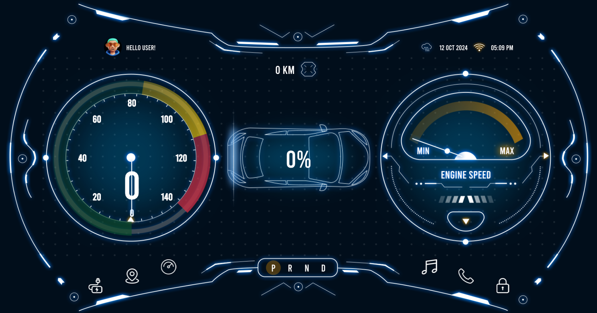
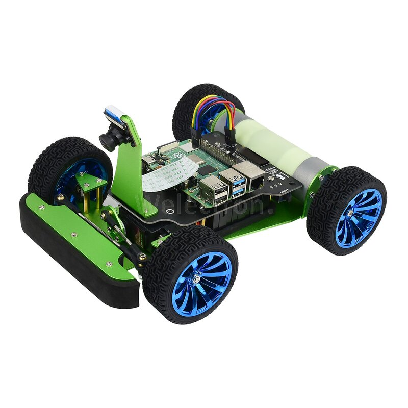
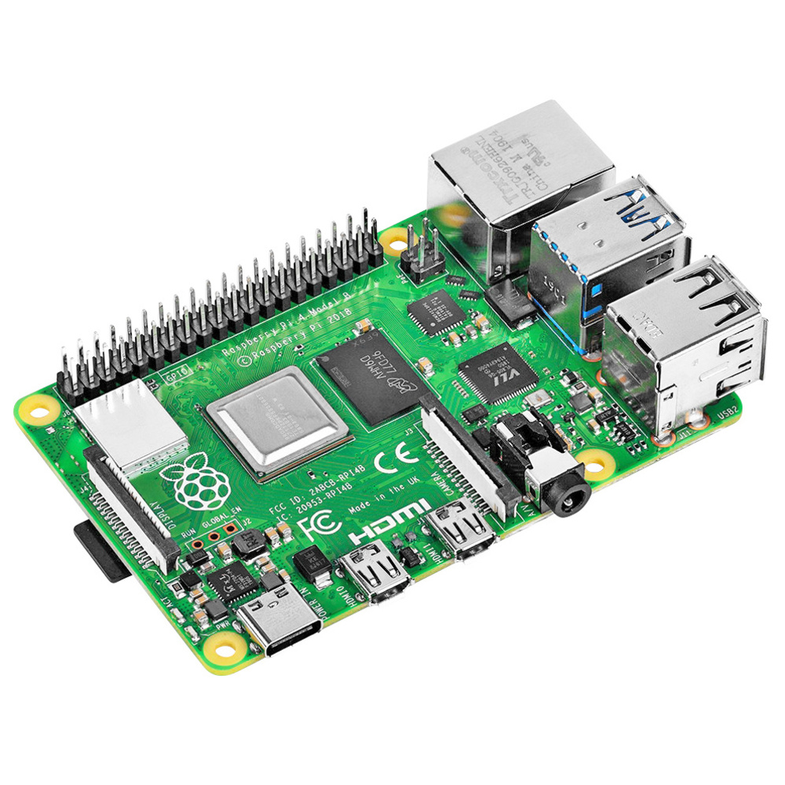
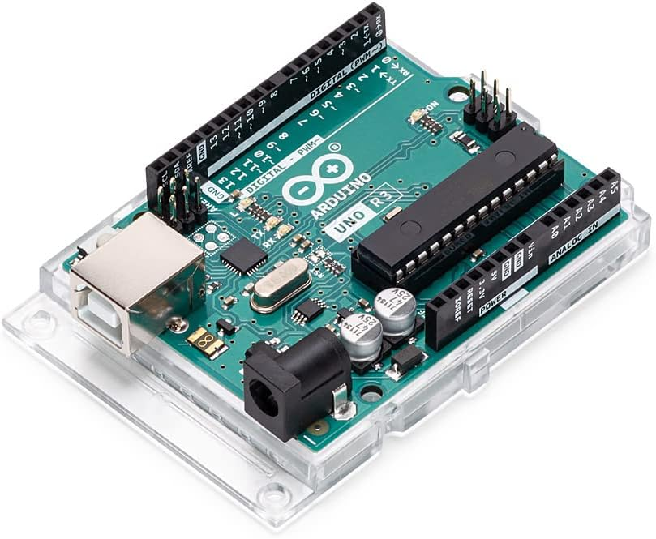
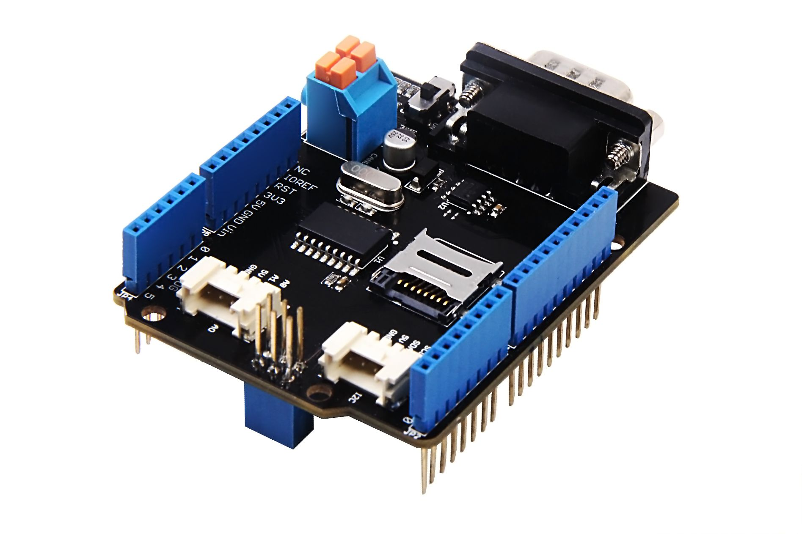
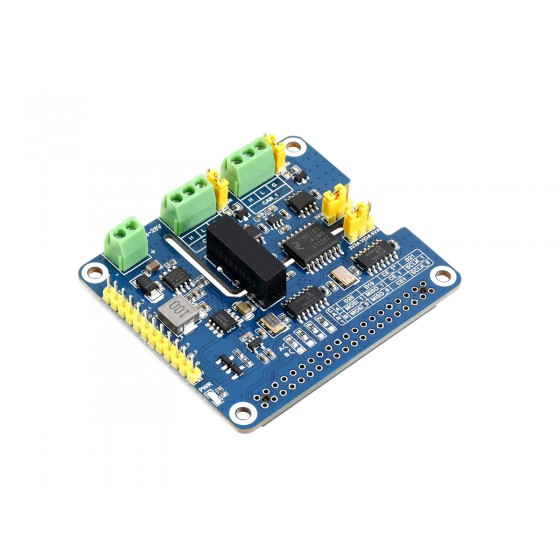
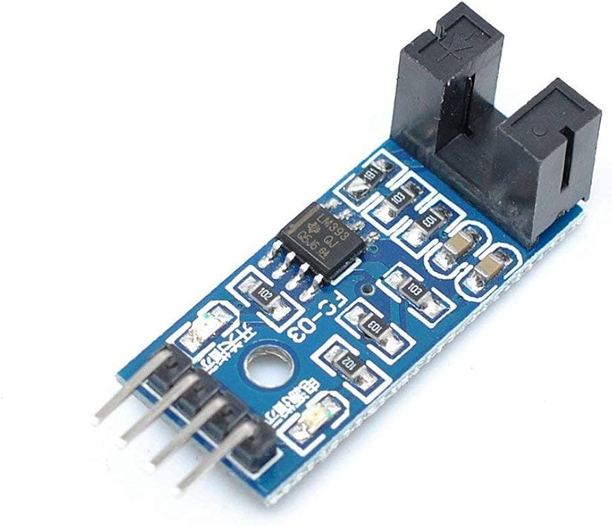
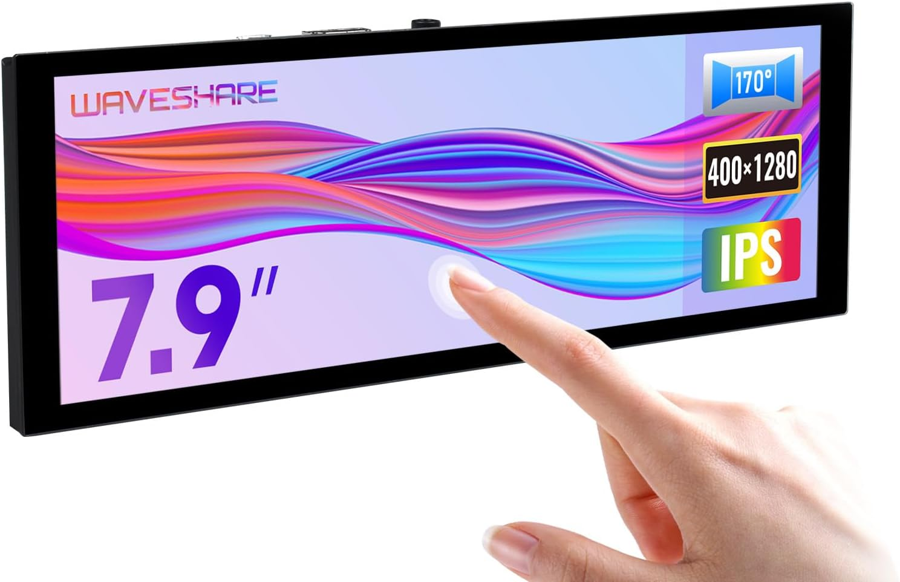

# **DES Project - Instrument Cluster**

- [**DES Project - Instrument Cluster**](#des-project---instrument-cluster)
  - [Introduction](#introduction)
  - [Project Overview](#project-overview)
  - [Technical Stack](#technical-stack)
  - [Development Features](#development-features)
  - [Module Descriptions](#module-descriptions)
  - [Additional Setup](#additional-setup)


## Introduction

  

A modern Qt6 QML-based instrument cluster application designed for PiRacer, running on Raspberry Pi. This project implements a comprehensive dashboard that displays real-time vehicle metrics including speedometer, tachometer, and battery status through Controller Area Network (CAN) protocol and I2C communication. <br clear="left"/>                


## Project Overview
This instrument cluster application provides a dynamic automotive-grade interface featuring:

- Digital speedometer with real-time speed data from Arduino sensors
- Tachometer displaying motor RPM
- Battery level indicator with status monitoring via I2C
- Modern UI/UX built with Qt6 QML
- CAN protocol integration for reliable vehicle data communication
</br>

## Technical Stack
- Qt6 QML for fluid, hardware-accelerated graphics
- C++ backend for CAN communication and data processing
- Raspberry Pi as the target platform
- Arduino for speed sensor data acquisition
- Cross-compilation setup for Raspberry Pi deployment
- Controller Area Network (CAN) for vehicle data transmission
- I2C protocol for battery data communication
</br>

| **Components**                              	| **image**                                                  	                              |
|-----------------------------------------------|-------------------------------------------------------------------------------------------|
| **Pi Racer**                                 	|                   |
| **Raspberry Pi 4** Model B 8GB RAM           	|             |
| **Arduino UNO REV3**                        	|                 |
| **Seeed Studio CAN-BUS Shield V2.0**			    | |
| **Waveshare CAN-BUS (FD) HAT**				        | |
| **Speed Sensor (LM393)**                     	|           |
| **Waveshare 7.9 Inch DSI Screen**            	|      |
</br>

## Development Features
- Cross-compilation environment for building Qt applications on Raspberry Pi
- Arduino integration for speed sensor data collection
- CAN communication between Arduino and Raspberry Pi
- Responsive QML interface optimized for embedded displays
- Real-time data processing and visualization
- I2C communication for battery monitoring

## Module Descriptions

### Arduino Module
- **CAN Shield**
  - Collects speed sensor data from the vehicle
  - Processes and packages sensor readings
  - Transmits data via CAN protocol to Raspberry Pi
- **I2C Communication**
  - Implements I2C protocol for battery data collection
  - Monitors battery status in real-time
  - Provides accurate battery level measurements

### Raspberry Pi
- **CAN HAT**
  - Receives data packets from Arduino's CAN shield
  - Processes incoming CAN messages
  - Relays processed data to the Qt application
- **I2C Interface**
  - Directly interfaces with battery monitoring system
  - Collects real-time battery metrics
  - Forwards battery data to Qt application for visualization

### Qt Application
- **Dashboard UI**
  - Modern, responsive QML-based interface
  - Real-time visualization of vehicle metrics
  - Configurable display layouts and themes
  - Smooth animations and transitions
- **Data Communication**
  - Processes incoming CAN messages from vehicle sensors
  - Handles I2C data for battery monitoring
  - Implements data validation and error handling
  - Real-time updates without performance impact

### Additional Setup

- **[PiRacer Assembly](https://github.com/hirca/DES-PiRacer-Assembly)** should be done first.

- **CAN Configuration**

```bash
sudo apt install can-utils
sudo ip link set can0 type can bitrate 500000
sudo ip link set up can0
```
